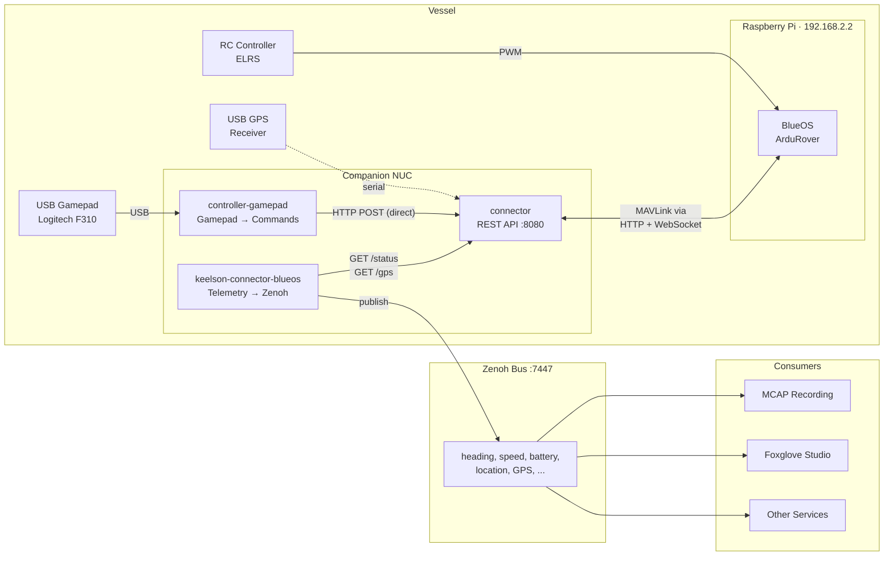
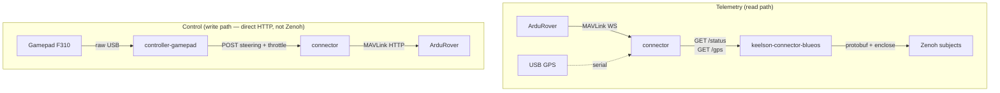

# ssrsblue

Software stack for the SSRS autonomous surface vessel. Three containers run on a companion NUC connected to a Raspberry Pi running BlueOS + ArduRover.

## System overview



> **Note:** The gamepad controller sends commands **directly** to the connector via HTTP POST — it does not go through Zenoh. This is intentional: manual control needs low latency, and the connector validates and rate-limits commands before forwarding to ArduPilot. Keelson/Zenoh is used only for the telemetry read path.

## Data flow



## Containers

| Container                    | Purpose                                                                   | Port    | Source                                                   |
| ---------------------------- | ------------------------------------------------------------------------- | ------- | -------------------------------------------------------- |
| **connector**                | REST API gateway to ArduRover via BlueOS MAVLink2REST                     | `:8080` | [`connector/`](connector/)                               |
| **keelson-connector-blueos** | Polls connector, publishes telemetry to Zenoh/keelson                     | —       | [`keelson-connector-blueos/`](keelson-connector-blueos/) |
| **controller-gamepad**       | Reads USB gamepad, sends manual control commands (direct HTTP, not Zenoh) | —       | [`controller-gamepad/`](controller-gamepad/)             |

## Quick start

```bash
# Start everything
docker compose -f connector/docker-compose.yml up -d
docker compose -f keelson-connector-blueos/docker-compose.yml up -d
docker compose -f controller-gamepad/docker-compose.yml up -d

# Or run locally for development
cd connector && uv sync && uv run uvicorn connector.main:app --port 8080
cd keelson-connector-blueos && pip install -r requirements.txt && python bin/main.py -r rise -e ssrs18 -s blueos/0 --blueos-url http://localhost:8080 --connect tcp/localhost:7447
cd controller-gamepad && pip install -r requirements.txt && python bin/main.py --blueos-url http://localhost:8080
```

## Keelson subjects published

### From `/status` → `{source}/autopilot`

| Subject                       | Type                   | Description                |
| ----------------------------- | ---------------------- | -------------------------- |
| `vehicle_mode`                | `TimestampedString`    | MANUAL, GUIDED, HOLD, etc. |
| `vehicle_armed`               | `TimestampedBool`      | Arm state                  |
| `heading_true_north_deg`      | `TimestampedFloat`     | Compass heading            |
| `speed_over_ground_knots`     | `TimestampedFloat`     | Converted from m/s         |
| `location_fix`                | `foxglove.LocationFix` | Autopilot position         |
| `gps_fix_type`                | `TimestampedInt`       | 0=none, 3=3D, 5=RTK        |
| `battery_voltage_v`           | `TimestampedFloat`     |                            |
| `battery_current_a`           | `TimestampedFloat`     |                            |
| `battery_state_of_charge_pct` | `TimestampedFloat`     | 0–100                      |
| `autopilot_throttle_pct`      | `TimestampedFloat`     | Actual output              |
| `rudder_angle_deg`            | `TimestampedFloat`     | Last commanded steering    |
| `engine_throttle_pct`         | `TimestampedFloat`     | Last commanded throttle    |

### From `/gps` → `{source}/gps`

| Subject                        | Type                   | Description      |
| ------------------------------ | ---------------------- | ---------------- |
| `location_fix`                 | `foxglove.LocationFix` | WGS84 + altitude |
| `location_fix_satellites_used` | `TimestampedInt`       |                  |
| `location_fix_hdop`            | `TimestampedFloat`     |                  |
| `speed_over_ground_knots`      | `TimestampedFloat`     | From NMEA RMC    |
| `course_over_ground_deg`       | `TimestampedFloat`     | From NMEA RMC    |
| `altitude_above_msl_m`         | `TimestampedFloat`     | From NMEA GGA    |

## Network

```
NUC ──ethernet── Raspberry Pi (192.168.2.2)
                  └── BlueOS DHCP → NUC gets 192.168.2.x
```

BlueOS exposes MAVLink2REST at `http://192.168.2.2/mavlink2rest`. The connector talks to it over HTTP (commands) and WebSocket (telemetry).

## Safety

- **Watchdog**: connector sends neutral steering+throttle if no commands arrive for 2s while armed
- **Gamepad disconnect**: controller sends neutral immediately, then retries connection
- **Pilot override**: RC controller always wins via ArduRover's mode channel
- **GCS failsafe**: if connector dies, ArduPilot triggers failsafe after 5s (no heartbeats)
