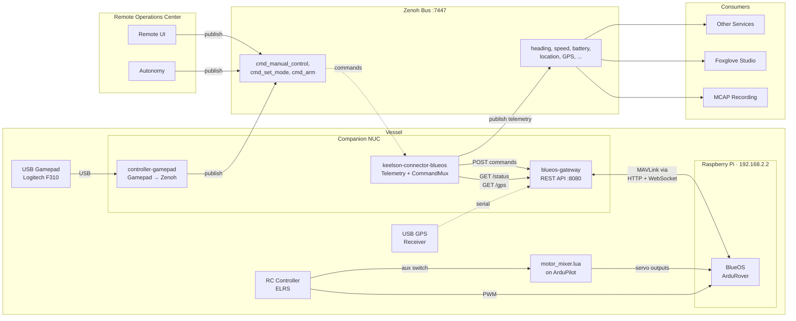
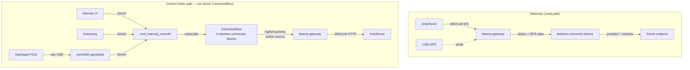

# ssrsblue

Software stack for the SSRS autonomous surface vessel. Three containers run on a companion NUC connected to a Raspberry Pi running BlueOS + ArduRover.

## System overview



## Data flow



## Command arbitration (CommandMux)

All command sources publish to Zenoh and the vessel-side `CommandMux` (in keelson-connector-blueos) selects the highest-priority active source. Inspired by the ROS `twist_mux` pattern.

| Source        | Priority | Timeout  | Description                   |
| ------------- | -------- | -------- | ----------------------------- |
| `e_stop`      | 255      | 0 (lock) | Emergency stop — stays active |
| `gamepad/*`   | 100      | 0.5s     | Manual gamepad control        |
| `autonomy/*`  | 50       | 2.0s     | Autonomous navigation         |
| `remote_ui/*` | 10       | 1.0s     | Remote operator UI            |

When a source stops publishing and its timeout expires, the mux falls through to the next lower-priority active source. If all sources time out, neutral (0,0) is sent.

Mode changes (`cmd_set_mode`) and arm/disarm (`cmd_arm`) bypass priority — any source can send them directly.

### Command subjects

| Subject                 | Type                | Description                                   |
| ----------------------- | ------------------- | --------------------------------------------- |
| `cmd_manual_control`    | `TimestampedString` | JSON `{"steering": float, "throttle": float}` |
| `cmd_set_mode`          | `TimestampedString` | Mode name (MANUAL, GUIDED, HOLD, etc.)        |
| `cmd_arm`               | `TimestampedBool`   | true=arm, false=disarm                        |
| `cmd_active_source`     | `TimestampedString` | Force a specific source (manual override)     |
| `active_command_source` | `TimestampedString` | Published by mux: current active source       |

## Motor Mixing (Lua Script)

The vessel has 3 motors: 2x Blue Robotics thrusters (skid steering) and 1x Flipsky thruster (forward boost). A Lua script (`ardupilot-scripts/motor_mixer.lua`) runs on ArduPilot at 50Hz and handles mixing.

**Motor modes** (selected by RC aux switch or software API):

| Mode            | Blue Robotics L/R   | Flipsky     | Use case              |
| --------------- | ------------------- | ----------- | --------------------- |
| `blue_robotics` | Skid steering (T±S) | Off         | Maneuvering           |
| `all`           | Skid steering (T±S) | Forward (T) | Full power + steering |
| `flipsky`       | Off                 | Forward (T) | Cruising, no steering |

**Mode selection priority:**

1. **RC aux switch** (`RCx_OPTION=300`) — physical, always wins. Low/Mid/High = blue_robotics/all/flipsky.
2. **Gateway API** (`POST /command/motor_mode`) — sets `SCR_USER1` via MAVLink PARAM_SET.

The gamepad doesn't know about motors — it just sends steering + throttle. ArduPilot processes it normally, and the Lua script distributes the output.

### ArduPilot Parameters

```
SCR_ENABLE       = 1
SERVO1_FUNCTION  = 94  (Script1 → Blue Robotics Left)
SERVO2_FUNCTION  = 95  (Script2 → Blue Robotics Right)
SERVO3_FUNCTION  = 96  (Script3 → Flipsky)
RCx_OPTION       = 300 (Scripting1 — aux switch for mode)
```

Upload the script via BlueOS File Browser → `configs/ardupilot-manager/firmware/scripts/motor_mixer.lua`

## Containers

| Container                    | Purpose                                                 | Port    | Source                                                   |
| ---------------------------- | ------------------------------------------------------- | ------- | -------------------------------------------------------- |
| **blueos-gateway**           | REST API gateway to ArduRover via BlueOS MAVLink2REST   | `:8080` | [`blueos-gateway/`](blueos-gateway/)                     |
| **keelson-connector-blueos** | Telemetry publisher + command mux (subscribe → forward) | —       | [`keelson-connector-blueos/`](keelson-connector-blueos/) |
| **controller-gamepad**       | Reads USB gamepad, publishes commands to Zenoh          | —       | [`controller-gamepad/`](controller-gamepad/)             |

## Quick start

```bash
# Start everything
docker compose -f blueos-gateway/docker-compose.yml up -d
docker compose -f keelson-connector-blueos/docker-compose.yml up -d
docker compose -f controller-gamepad/docker-compose.yml up -d

# Or run locally for development
cd blueos-gateway && uv sync && uv run uvicorn blueos_gateway.main:app --port 8080
cd keelson-connector-blueos && pip install -r requirements.txt && python bin/main.py -r rise -e ssrs18 -s blueos/0 --blueos-url http://localhost:8080 --connect tcp/localhost:7447
cd controller-gamepad && pip install -r requirements.txt && python bin/main.py -r rise -e ssrs18 -s gamepad/0 --connect tcp/localhost:7447
```

## Keelson subjects published

### From `/status` → `{source}/autopilot`

| Subject                       | Type                   | Description                |
| ----------------------------- | ---------------------- | -------------------------- |
| `vehicle_mode`                | `TimestampedString`    | MANUAL, GUIDED, HOLD, etc. |
| `vehicle_armed`               | `TimestampedBool`      | Arm state                  |
| `heading_true_north_deg`      | `TimestampedFloat`     | Compass heading            |
| `speed_over_ground_knots`     | `TimestampedFloat`     | Converted from m/s         |
| `location_fix`                | `foxglove.LocationFix` | Autopilot position         |
| `gps_fix_type`                | `TimestampedInt`       | 0=none, 3=3D, 5=RTK        |
| `battery_voltage_v`           | `TimestampedFloat`     |                            |
| `battery_current_a`           | `TimestampedFloat`     |                            |
| `battery_state_of_charge_pct` | `TimestampedFloat`     | 0–100                      |
| `autopilot_throttle_pct`      | `TimestampedFloat`     | Actual output              |
| `rudder_angle_deg`            | `TimestampedFloat`     | Last commanded steering    |
| `engine_throttle_pct`         | `TimestampedFloat`     | Last commanded throttle    |

### From `/gps` → `{source}/gps`

| Subject                        | Type                   | Description      |
| ------------------------------ | ---------------------- | ---------------- |
| `location_fix`                 | `foxglove.LocationFix` | WGS84 + altitude |
| `location_fix_satellites_used` | `TimestampedInt`       |                  |
| `location_fix_hdop`            | `TimestampedFloat`     |                  |
| `speed_over_ground_knots`      | `TimestampedFloat`     | From NMEA RMC    |
| `course_over_ground_deg`       | `TimestampedFloat`     | From NMEA RMC    |
| `altitude_above_msl_m`         | `TimestampedFloat`     | From NMEA GGA    |

## Network

```
Teltonika RUTX12 (192.168.1.1) — router, internet uplink
  ├── sealog / NUC        (192.168.1.206)
  ├── blueos / RPi        (192.168.1.248)
  ├── Axis camera         (192.168.1.138)
  ├── Ouster LiDAR        (192.168.1.142)
  └── Ubiquiti switch     (192.168.1.134)
```

> **Note:** BlueOS defaults to running a DHCP server on its ethernet interface at `192.168.2.2`. On this vessel the RPi is instead connected to the main LAN via the Teltonika router, so the default `192.168.2.x` network is not used. The gateway's `CONNECTOR_BLUEOS_HOST` is set to `192.168.1.248` to match.

BlueOS exposes MAVLink2REST at `http://192.168.1.248/mavlink2rest`. The gateway talks to it over HTTP (commands) and WebSocket (telemetry).

## Safety

- **Command mux timeout**: if a command source stops publishing, the mux falls through to lower-priority sources; if all time out, neutral (0,0) is sent
- **Gamepad disconnect**: controller publishes neutral immediately, then mux timeout provides backup
- **Pilot override**: RC controller aux channels remain active even while the gamepad sends MANUAL_CONTROL (only steer/throttle are overridden). RC takes back steering/throttle within `RC_OVERRIDE_TIME` (default 3s) if the gamepad stops.
- **Motor mode switch**: RC aux switch (`RCx_OPTION=300`) always overrides software motor mode selection.
- **GCS failsafe**: if blueos-gateway dies, ArduPilot triggers failsafe after 5s (no heartbeats)
- **Watchdog**: blueos-gateway sends neutral steering+throttle if no commands arrive for 2s while armed
