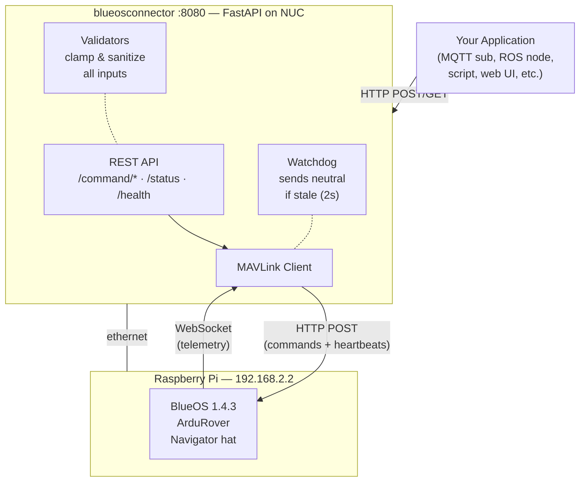

# BlueOS Connector

REST API gateway for controlling an ArduRover boat via BlueOS. Runs as a Docker container on a companion NUC, connected to the Raspberry Pi (BlueOS) over ethernet.

## Architecture



## How it works

1. **On startup**, the connector opens a WebSocket to BlueOS's MAVLink2REST service and starts receiving filtered telemetry (HEARTBEAT, GPS, battery, speed).

2. **Every second**, it sends a MAVLink heartbeat to ArduPilot so the GCS failsafe doesn't trigger.

3. **Your application** sends HTTP requests to the connector's REST API. The connector validates inputs, builds the correct MAVLink JSON payload, and POSTs it to BlueOS.

4. **The watchdog** monitors command flow. If you're in GUIDED or STEERING mode and no commands arrive for 2 seconds, it sends neutral (stop) to prevent the boat from continuing at the last commanded speed.

5. **The pilot** always has physical override via the ELRS RC controller. ArduRover's mode switch (`MODE_CH`) determines who's in control.

## Network setup

Just plug an ethernet cable between the NUC and the Raspberry Pi. BlueOS runs a DHCP server and assigns the NUC an IP in the `192.168.2.x` range. No manual configuration needed.

BlueOS is reachable at:
- `192.168.2.2` (static IP, always works)
- `blueos.local` (mDNS, if avahi/bonjour is available on the NUC)

## Quick start

```bash
# Development (no Docker)
cd connector
uv sync
uv run uvicorn connector.main:app --port 8080 --reload

# Run tests
uv run pytest tests/ -v

# Docker
docker compose up --build
```

## API

### Commands

```bash
# Steering + throttle (works in MANUAL, STEERING, GUIDED)
curl -X POST http://localhost:8080/command/manual_control \
  -H "Content-Type: application/json" \
  -d '{"steering": 0, "throttle": 300}'

# Set mode (by name or number)
curl -X POST http://localhost:8080/command/set_mode \
  -H "Content-Type: application/json" \
  -d '{"mode": "GUIDED"}'

# Arm / disarm
curl -X POST http://localhost:8080/command/arm
curl -X POST http://localhost:8080/command/disarm

# GUIDED: go to position
curl -X POST http://localhost:8080/command/guided/position \
  -H "Content-Type: application/json" \
  -d '{"lat": 47.3977, "lon": 8.5455}'

# GUIDED: set velocity (body frame, m/s)
curl -X POST http://localhost:8080/command/guided/velocity \
  -H "Content-Type: application/json" \
  -d '{"vx": 2.0, "vy": 0.0, "yaw": 90}'

# GUIDED: set heading + speed
curl -X POST http://localhost:8080/command/guided/heading \
  -H "Content-Type: application/json" \
  -d '{"heading": 180, "speed": 1.5}'
```

### Status

```bash
# Vehicle state (mode, GPS, battery, heading, speed)
curl http://localhost:8080/status

# Connector health
curl http://localhost:8080/health
```

Example responses:

```json
// GET /status
{
  "mode": 15,
  "mode_name": "GUIDED",
  "armed": true,
  "gps_fix_type": 3,
  "lat": 47.3977,
  "lon": 8.5455,
  "satellites_visible": 12,
  "battery_voltage": 14.2,
  "battery_current": 3.5,
  "battery_remaining": 85,
  "heading": 180,
  "groundspeed": 1.2,
  "throttle": 30
}

// GET /health
{
  "status": "ok",
  "mavlink_connected": true,
  "last_heartbeat_age_s": 0.4,
  "uptime_s": 3600.1,
  "watchdog_active": false
}
```

## Configuration

All via environment variables (prefix `CONNECTOR_`):

| Variable | Default | Description |
|----------|---------|-------------|
| `CONNECTOR_BLUEOS_HOST` | `192.168.2.2` | BlueOS IP or hostname |
| `CONNECTOR_SYSTEM_ID` | `254` | MAVLink system ID (avoid 255 if QGC is running) |
| `CONNECTOR_WATCHDOG_TIMEOUT` | `2.0` | Seconds before watchdog sends neutral |
| `CONNECTOR_LOG_LEVEL` | `INFO` | Python log level |

## MANUAL_CONTROL axis mapping

Verified against [ArduPilot source](https://github.com/ArduPilot/ardupilot/blob/master/Rover/GCS_MAVLink_Rover.cpp):

| Axis | Range | ArduRover |
|------|-------|-----------|
| x | -1000..1000 | Ignored |
| **y** | **-1000..1000** | **Steering** (-1000=full left, 0=straight, 1000=full right) |
| **z** | **-1000..1000** | **Throttle** (-1000=full reverse, 0=stop, 1000=full forward) |
| r | -1000..1000 | Ignored |

## GUIDED mode type_mask values

From [ArduPilot Rover Commands](https://ardupilot.org/dev/docs/mavlink-rover-commands.html):

| Command | type_mask | Notes |
|---------|-----------|-------|
| Position only | 3580 | lat/lon via `SET_POSITION_TARGET_GLOBAL_INT` |
| Velocity only | 3559 | vx/vy via `SET_POSITION_TARGET_LOCAL_NED` |
| Velocity + yaw | 2535 | vx/vy + yaw target |
| Heading + speed | 39 | via `SET_ATTITUDE_TARGET`, thrust -1..+1 |

## Safety

- **Watchdog**: Sends neutral (steering=0, throttle=0) if no commands arrive for 2s while armed in GUIDED/STEERING. Kicks in before ArduRover's own 3s `RC_OVERRIDE_TIME`.
- **Mode gating**: GUIDED position/velocity/heading commands are rejected with HTTP 400 if the vehicle isn't in GUIDED mode or isn't armed.
- **Input validation**: All values clamped to valid ranges. Pydantic rejects out-of-range inputs with HTTP 422.
- **Pilot override**: The RC controller always wins. `MODE_CH` on the RC determines the active mode. The companion cannot override the pilot's mode switch.
- **Heartbeats**: Sent at 1 Hz. If the connector dies, ArduPilot's GCS failsafe triggers after `FS_GCS_TIMEOUT` (default 5s).

## Project structure

```
connector/
├── Dockerfile              Multi-stage: test → production
├── docker-compose.yml      network_mode: host, env config
├── pyproject.toml          uv + hatchling
├── uv.lock
├── src/connector/
│   ├── main.py             FastAPI app + lifespan
│   ├── config.py           Env-based settings (CONNECTOR_*)
│   ├── models.py           Pydantic request/response models
│   ├── mavlink_client.py   WebSocket telemetry + HTTP commands
│   ├── vehicle_state.py    Shared state + ArduRover mode map
│   ├── validators.py       Input clamping/validation
│   ├── watchdog.py         Safety: neutral on stale commands
│   └── routes/
│       ├── commands.py     POST /command/*
│       └── status.py       GET /status, /health
└── tests/                  61 tests
    ├── test_validators.py
    ├── test_routes.py
    └── test_mavlink_payloads.py
```

## Tests

```bash
uv run pytest tests/ -v

# Tests run during Docker build (test stage)
docker build --target test .

# Production build (no test files in image)
docker compose build
```

The test suite includes:
- **Validator tests**: Clamping ranges, mode validation, edge cases
- **Route tests**: All endpoints with mocked MAVLink client, status codes, error handling
- **Payload tests**: Verify actual MAVLink JSON structure matches ArduPilot expectations (axis mapping, type_mask values, quaternion encoding, thrust range, base_mode bits)
